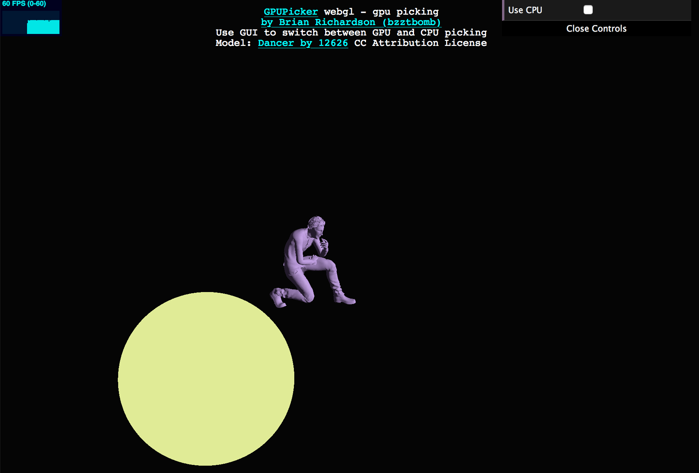

# GPU Object Picking for Three.JS

## Overview

This library is a production ready implementation of GPU object picking for Three.JS.  The advantage this library has over the other ones that are already available is that it doesn't require a seperate picking scene.  This is a big deal because you do not have to keep a second scene in sync with the scene that is being rendered.

GPU Picking also works with skinned meshes and performs better with meshes that have a high poly count.  The Three.JS raycaster does not currently work with skinned meshes.  These cases are shown in the example that is provided.  The yellow sphere below has over a half million polys.  If CPU picking is used the framerate will drop while the pick is happening, using GPU picking the framerate remains constant.  The other case is skinned meshes.  If CPU picking is used picking only works against the initial pose of the object whereas GPU picking works against the current animated pose.


Note: The example loads slowly because the sphere has so many polys in it.

## Install

Two Options:

A) Install with npm, `npm install three_gpu_picking`

B) This is a one file library, one can just copy gpupicker into their project 

## Usage

### Import the picker

`import { GPUPicker } from 'three_gpu_picking';`

### Create the picker with the following parameters

* THREE: reference to the ThreeJS library.  I do it this way to avoid issues I've had in the past with WebPack having multiple copies of ThreeJS imported and causing issues.
* renderer: A reference to the THREE.Renderer (must be a WebGLRenderer) being used.
* scene: A reference to the THREE.Scene
* camera: A reference to the camera

```javascript
  // Here's an example that works for GLTF objects.
  var picker = new GPUPicker(THREE, renderer, scene, camera);
```

### Use the picker

Call GPUPicker.pick with the following parameters:

* x, the x coordinate of the location you want to pick in.  Make sure to multiply by `window.devicePixelRatio`
* y, the y coordinate of the location you want to pick in.  Make sure to multiply by `window.devicePixelRatio`
* shouldPickObject, optional, a callback that allows you to not consider some objects pickable.  Return false to skip an object.

```javascript
  var objectId = picker.pick(ev.clientX * window.devicePixelRatio, ev.clientY * window.devicePixelRatio, obj => {
    return obj.myPickingFlag;
  });
```

This should happen pretty much directly after `renderer.render` is called.  Depending on how complicated your render loop is, you may need to store the 
picking coordinates of `onMouseUp` in a variable and then process the pick in your render call.  There's an example of this [here](https://github.com/bzztbomb/three_js_outline/blob/trunk/example/src/index.ts#L107)

### Custom shaders

If you have an object that requires a custom material for picking (due to vertex animation or you want alpha support).  Set a `pickingMaterial` property on it and the `GPUPicker` will use it.

## Authors / Thanks

This library was developed at [Torch](https://torch.app) by [Brian Richardson](https://github.com/bzztbomb/) with bugfixes from [Josh Faust](https://github.com/jfaust).  Big thanks to [Torch](https://torch.app) for allowing us to release this library!

The [dancer model](https://sketchfab.com/3d-models/breakdanceanimation--0b5ac21a30e34c2f8011d57d9e017295) is by [12626](https://sketchfab.com/12626) used by CC Attribution License.
